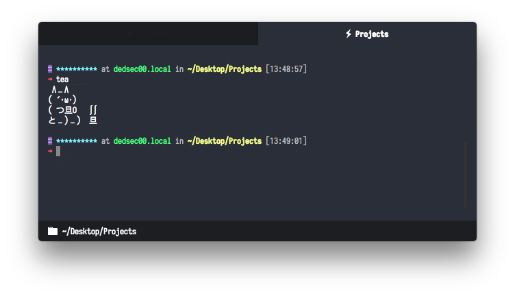

# hype-title

[](https://git.inc.sh/NetOperatorWibby/hype-title)

> Set the [Hyper](https://hyper.is) tab title to the folder you are in

It is kind of irritating to see a truncated title, you just need to see the current directory name.


### Preview




### Screenshot Details

- Font: Iosevka @ 12pt
- Plugins:
  - hyper-statusline
  - hyper-tabs-enhanced
  - hyper-working-directory
  - hypercwd
  - hyperterm-bold-tab
  - hyperterm-close-on-left
  - hyper-hide-title
  - hype-title
  - hype-dracula
- Shell: [zsh](http://ohmyz.sh)


### Install

```bash
$ hyper i hype-title
```

Or, you can install `hype-title` manually by adding it to the plugins list in your `~/.hyper.js` config file.


### License

MIT © [Paul Anthony Webb](https://pw-software.com)
